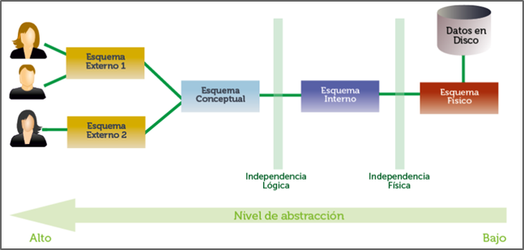
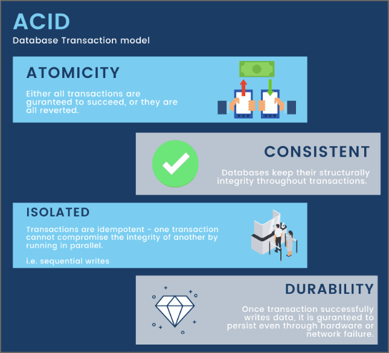
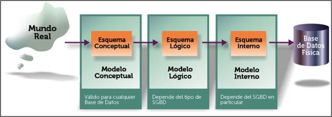

## 1. Necesidad de gestionar datos

En informática se conoce como **dato** a cualquier elemento informativo que tenga relevancia para el sistema. Desde el inicio de la informática se ha reconocido al dato como al elemento fundamental de trabajo en un ordenador. Por ello se han realizado numerosos estudios y aplicaciones para mejorar la gestión de los mismos empleando sistemas informáticos.

Inicialmente los datos que se necesitaba almacenar y gestionar eran pocos, pero poco a poco han ido creciendo. En la actualidad, las numerosas aplicaciones de Internet han producido enormes sistemas de información que incluso para poder gestionarlos requieren de gran número de máquinas haciendo la información accesible desde cualquier parte del planeta y de manera instantánea.

La escritura fue la herramienta que permitió al ser humano poder gestionar conjuntos de datos cada vez más grandes. Además de permitir compartir esa información entre diferentes personas, también posibilitó que esos datos se guardaran de manera continua e incluso estuvieran disponibles para las siguientes generaciones.

Para poder almacenar datos y cada vez más datos, el ser humano ideó nuevas herramientas archivos, cajones, carpetas y fichas en las que se almacenaban los datos.

La informática adaptó sus herramientas para que los elementos que el usuario maneja en el ordenador se parezcan a los que utilizaba manualmente. Así en informática se sigue hablado de ficheros, formularios, carpetas, directorios,...

## 2. Sistemas basados en archivos

En el ámbito de la informática, para almacenar información se utiliza un elemento clave llamado **archivo** o **fichero**. Básicamente están formados por una secuencia de dígitos binarios que, siguiendo una estructura lógica determinada, almacenan una información concreta, como por ejemplo, un informe, una imagen, una canción, etc. Suponen una manera de almacenar información en elementos de almacenamiento permanente, lo que se conoce como memoria secundaria.

Antes de que surgieran los sistemas gestores de bases de datos, que veremos en los apartados siguientes, la información se gestionaba utilizando sistemas de archivos donde cada aplicación:

- Tenía un conjunto de archivos de datos y un conjunto de programas que los gestionaban.
- Gestionaba sus propios archivos de datos.

Este método de gestión de datos presentaba muchos inconvenientes:

- **Redundancia de los datos:** se produce porque los archivos son creados por distintos programas y van cambiando a lo largo del tiempo pudiendo duplicarse los datos.
- **Dependencia de los datos física-lógica:** la estructura física de los datos se encuentra codificada en los programas de aplicación. Cualquier cambio en esa estructura implica al programador identificar, modificar y probar todos los programas que manipulan esos archivos.
- **Separación y aislamiento de los datos:** al estar repartidos en varios archivos, y tener diferentes formatos, es difícil escribir nuevos programas que aseguren la manipulación de los datos correctos.
- **Dificultad para el acceso concurrente:** en un sistema de gestión de archivos es complicado que los usuarios actualicen los datos simultáneamente. Las actualizaciones concurrentes pueden dar por resultado datos inconsistentes.
- **Problemas en la seguridad de los datos:** resulta difícil implantar restricciones de seguridad pues las aplicaciones se van añadiendo al sistema según se van necesitando.
- **Problemas de integridad de datos:** los valores almacenados en los archivos deben cumplir con restricciones de consistencia. Por ejemplo, no se puede insertar una nota de un alumno en una asignatura si previamente esa asignatura no está creada. Esto implica añadir gran número de líneas de código en los programas.

## 3. Sistemas de gestión de bases de datos

Para resolver los inconvenientes de emplear sistemas de archivos en la gestión de datos surgieron los llamados sistemas de gestión de bases de datos (SGBD) formados por:

- **Base de datos** → Colección de datos.
- **Sistema de gestión** → Conjunto de programas para almacenar y recuperar los datos.

En estos sistemas se proporciona un conjunto coordinado de programas, procedimientos y lenguajes que permiten a los distintos usuarios realizar sus tareas habituales con los datos, garantizando su seguridad e integridad. Es habitual referirse a ellos con las siglas en inglés **DBMS** (Database Management system).

### 3.1. Funciones

El éxito del SGBD reside en mantener la seguridad e integridad de los datos, para ello ofrecerá una serie de herramientas que permitan:

- Crear la estructura de los datos y de la propia base de datos.
- Crear y administrar la estructura física en las unidades de almacenamiento.
- Manipular los datos permitiendo añadir, borrar, modificar o consultar.
- Crear copias de seguridad y permitir su recuperación.
- Gestionar la comunicación con la base de datos.
- Instalar la base de datos.
- Exportar e importar datos.

### 3.2. Modelo ANSI/X3/SPARC

En 1975, el organismo ANSI-SPARC (American National Standards Institute – Standards Planning And Requirements Committee) creó un diseño abstracto para estandarizar la manera en que los SGBD administraban las bases de datos.

Este diseño constaba de una arquitectura de tres niveles: externo, conceptual e interno. Con esto se conseguía separar la visión que los usuarios tenían de la base de datos con los detalles internos de su estructura y toda su complejidad. Esta arquitectura es la que la mayoría de los SGBD emplean:

- **Nivel externo o de visión:** enfocado al usuario de la base de datos. Se muestra al usuario la información que le es pertinente y en el formato adecuado. En este nivel se oculta al usuario la información que no tiene permitido ver.
- **Nivel conceptual:** nivel que determina la organización de los datos en la base de datos. Está determinado la información que se almacena y qué relaciones e interrelaciones existen entre los mismos datos. El administrador de la bases de datos debería ser el único usuario con acceso.
- **Nivel interno o físico:** determina cómo están almacenados los datos físicamente en el sistema informático. Concreta los detalles de almacenamiento de cada conjunto de datos, tales como el tipo de dato para cierto campo, el método de acceso a una tabla, etc.

En definitiva, este modelo es una propuesta teórica sobre cómo debe funcionar un SGBD con la arquitectura siguiente:

### 3.3. Tipos

En base al modo de describir los datos internamente en una base de datos junto con sus relaciones, restricciones, etc. se establecen diferentes tipos de SGBD. Los que nos encontramos actualmente serían:

- **Relacionales:** se utiliza un grupo de tablas para representar los datos y las relaciones entre ellos. Cada tabla está formada por varias columnas que representan propiedades de las filas. Cada fila se identifica, por una clave primaria o identificador. Permite combinar diferentes tablas para formar otras nuevas. Se trata del modelo de datos más usado actualmente.

- **Orientadas a objetos:** buscan adaptar las bases de datos a la programación orientada a objetos. Se intenta solventar las limitaciones de los SGBD relacionales, como puede ser el problema de la herencia o los tipos definidos por el usuario.

- **Relacionales orientados a objetos:** tratan de ser un híbrido entre el modelo relacional y el orientado a objetos. Se intenta conseguir una compatibilidad relacional, dando la posibilidad de integrar mejoras de la orientación a objetos. Las últimas versiones de las actuales bases de datos como Oracle, Microsoft SQL Server y PostgreSQL se pueden considerar de este tipo, llamado ORDBMS.

Los últimos años han aparecido las llamadas bases de datos NoSQL orientadas principalmente al mundo del Big Data. Se tratarán en un apartado posterior.

### 3.4. Componentes

De modo general encontramos en los SGBD los siguientes componentes:

- **Lenguajes de la base de datos:** cualquier SGBD ofrece la posibilidad de utilizar lenguajes que permitan especificar los datos que componen la BD, su estructura, relaciones, reglas de integridad, control de acceso, características físicas y vistas externas de los usuarios. Esos lenguajes serían: Lenguaje de Definición de Datos (DDL), Lenguaje de Manejo de Datos (DML) y Lenguaje de Control de Datos (DCL).

- **Diccionario de datos:** lugar donde se deposita la información sobre la totalidad de los datos que forman la base de datos. Contiene las características lógicas de las estructuras que almacenan los datos, su nombre, descripción, contenido y organización.

- **Gestor de la base de datos:** parte software encargada de garantizar el correcto, seguro, íntegro y eficiente acceso y almacenamiento de los datos. Proporciona una interfaz entre los datos almacenados y los programas de aplicación que los manejan. Es un intermediario entre el usuario y los datos.

- **Usuarios:** en los SGBD existen diferentes perfiles de usuario, cada uno de ellos con un permisos concreto. Generalmente distinguiremos entre el administrador de la base de datos (DBA) y el resto de usuarios, donde encontramos a programadores, analistas, usuarios finales, etc.

- **Herramientas de la base de datos:** aplicaciones que permiten a los administradores la gestión de la base de datos, de los usuarios y permisos, generadores de formularios, informes, etc.

### 3.5. SGBD más extendidos

Actualmente existen diferentes SGBD disponibles. Según el ránking establecido en la página web DB-Engines, los más empleados actualmente serían, en ese orden:

1. **Oracle:** empleado principalmente en las bases de datos empresariales, se caracteriza por su alto rendimiento, escalabilidad y seguridad.
2. **MySQL:** es el más popular en la web, utilizado principalmente con el lenguaje de programación PHP.
3. **Microsoft SQL Server:** compite con Oracle dentro del entorno empresarial.
4. **PostgreSQL:** destaca su alto nivel de concurrencia y soporte para múltiples tipos de datos.
5. **MongoDB:** SGBD NoSQL más popular ofrece una alta disponibilidad y balanceo de carga.

## 4. Bases de datos NoSQL

NoSQL (Not Only SQL) es un término que engloba a una gran variedad de SGDB que almacenan los datos siguiendo diferentes formatos y estructuras, a diferencia de los SGBD del tipo relacional (los más usados históricamente) que organizan la información en estructuras concretas como son las tablas, filas y columnas.

Los SGBD NoSQL usan estructuras clave-valor, grafos, … y tampoco soportan el uso del lenguaje SQL, un estándar en el acceso y manipulación de información contenida en las bases de datos.

Las principales ventajas que ofrecen serían su escalabilidad y altas prestaciones con volúmenes grandes de datos. Sin embargo, y esa es la gran desventaja, adolecen de la llamada propiedad ACID (Atomicity, Consistency, Isolation, Durability) propia de los SGBD relaciones, los SQL. Esto puede provocar problemas de redundancia y fragmentación de datos.

Como norma, un SGBD NoSQL sería aconsejable cuando:

- El volumen de datos operacional es muy grande
- La escritura/lectura se realiza de modo masivo
- Se necesita un tiempo de respuesta rápido
- La información no es apta para ser consultada con lenguaje SQL
- Trabajaremos con tipos de datos flexibles y diversos

Algunas de los SGBD NoSQL actuales serían:

- MongoDB
- Cassandra
- Elasticsearch
- Redis

## 5. Diseño de bases de datos

Implementar el diseño de una base de datos consiste en definir su estructura de datos en un sistema de información determinado partiendo de una toma de requerimientos y análisis del sistema que se quiere modelizar.

La fase de análisis y recolección de requerimientos inicial producirá:

- Requisitos de datos: se utilizan como una fuente para el diseño de la base de datos y se deben especificarse en la forma más detallada y completa posible.
- Requisitos funcionales: utilizados como fuente para el diseño de la aplicación  final.

La fase de diseño de una base de datos debería englobar tres etapas:

- **Diseño conceptual:** crearemos una estructura de la información independiente de la tecnología a emplear. Su resultado es el llamado esquema conceptual. Este esquema constituye una descripción de alto nivel de la estructura de la base de datos independiente del SGBD final.
- **Diseño lógico:** partiremos del resultado del diseño conceptual, transformándolo y adaptándolo al modelo de SGBD que utilizaremos (relacional, orientado a objetos, etc.).
- **Diseño físico:** se transforma la estructura obtenida en el diseño lógico acorde al SGBD final y hardware donde se implementará la base de datos con el objetivo de conseguir una mayor eficiencia. Cada SGBD ha desarrollado un lenguaje propio para implementar el diseño físico de la base de datos con el fin de obtener el máximo rendimiento del hardware y del sistema operativo.

El diseño de una base de datos tiene gran importancia con el fin de evitar:

- Redundancia: repetir datos de forma innecesaria, malgastando espacio de almacenamiento y provocando inconsistencias.
- Imposibilidad de representar información: determinados aspectos de la organización pueden resultar imposibles o muy difíciles de modelizar.
